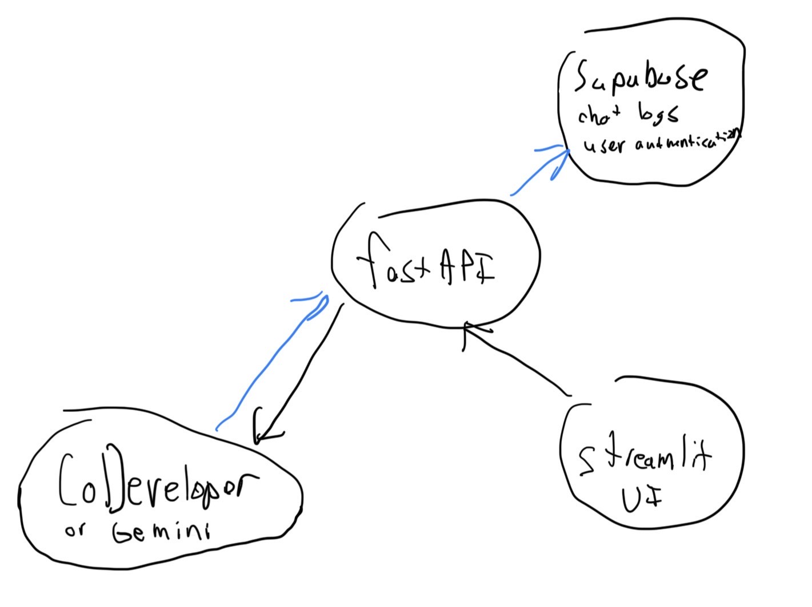
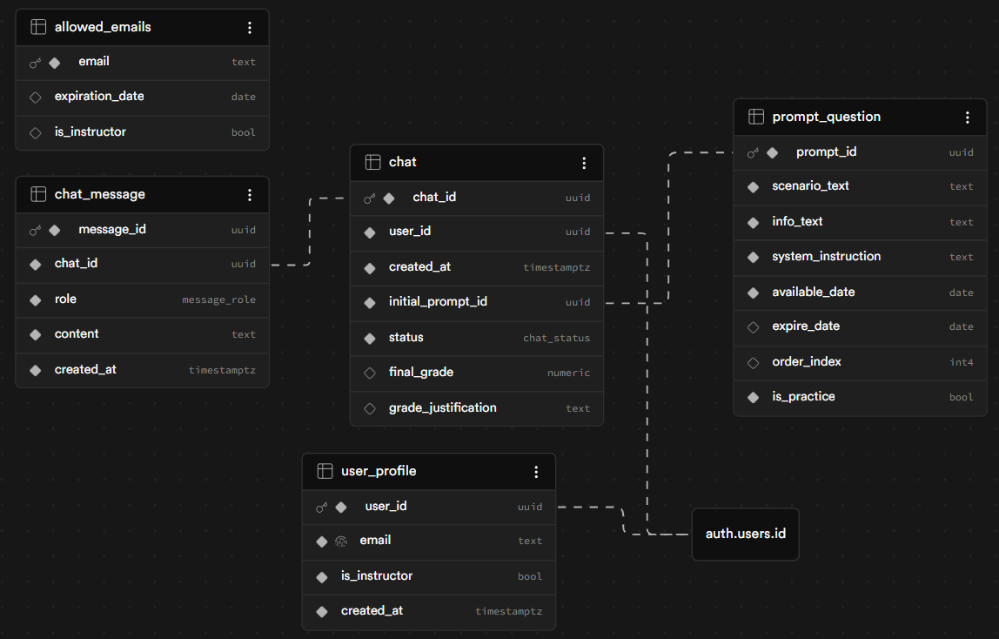

# FoodScienceExamAI

The purpose of this project is to create a way for students of a food science class to have a more interactive and fulfilling exam experience. 

## The problem
In a senior level class like the one this is being made for, most exams end up just asking you to regurgitate information you have learned to make sure you have learned/memorized the content required for the class. The professor would like to have more questions that require the student to read a case study, examine the root cause, and design an experiment to solve this problem. The issue with this is these exams are very tedious to grade and difficult to determine if what the student said is legitimate or not. 

## The solution
To solve this problem, we will use an AI system to aid in the grading process. The Institute of Food Technologies (IFT) recently built an AI system called CoDeveloper that has been trained on all of their published food science journals. I will build a system that will connect to this AI system via an API and grade student's responses to the problems and give a confidence score so the professor can know which students he should double check.

## General System Design

## ERD diagram in Supabase

## Daily Goals
| Date | Goal |
| --- | --- |
| 3/30/2026 | Make initial UI |
| 3/31/2026 | Connect to Gemini and prompt engineer |
| 4/1/2026 | Find open source journals and use them |
| 4/2/2026 | Continue fine tuning journal RAG use |
| 4/3/2026 | Request example gradings and add as many-shot |
| 4/4/2026 | Continue testing many-shot |
| 4/6/2026 | Meet with professor; Make it runnable on the cloud |
| 4/7/2026 | Debug problems with running on the cloud |
| 4/8/2026 |  Create database for storing chats |
| 4/9/2026 | Meet with IFT; Hopefully connect to co-developer |
| 4/10/2026 | Connect system to database |
| 4/11/2026 | Debug whole system; Create final presentation |
| 4/13/2026 | Present; document process and make tweaks |
| 4/14/2026 | Make final tweaks from professor |
| 4/15/2026 | Pass off to Dr. Kershaw |
